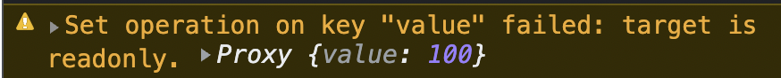

# Vue-note

Vue 跟 React 等相關框架都是資料決定畫面,有別於 MVC(Model View Controller ),Vue 則是 MVVM(Model View ViewModel)

而 Vue 是基於 ES6 proxy 實作,可以參考[proxy note](https://github.com/Zheng-Yan-Zhong/javascript-note#proxy)來了解寫法.

[Fake server](https://e-shop-tw.herokuapp.com/)

## `Table of Contents`

- [CLI (command line interface)](#CLI)
- [Events](#Events)
- [Option API (Vue2)](#Option-API)
- [Composition API (Vue3)](#Composition-API)
- [Lifecycle](#Lifecycle)
- [Slot](#slot)
- [Transition](#Transition)
- [Router](#Router)
- [State management](#State-management)
- [Packages](#Packages)
- [Configuration](#Configuration)
- [TDD](#TDD)

---

## `CLI`

由於 Vue 的主要作者開始推崇從 Vue-cli 轉移到 Vite,想當然我們使用的用戶也要與時俱進的學習.

- 開發模式不用打包全部依賴,而 Webpack 則是需要一次打包
- Vite 則是使用緩存的熱刷新,而 Webpack 則是整個重刷

[Vite](https://vitejs.dev/guide/#index-html-and-project-root)

```javascript
npm create vite@latest <fileName> --template-vue
```

[Vue cli](https://cli.vuejs.org/)

- 相較於 Vite,Vue cli 經過多個版本的驗證,保持良好得套件相依性

```javascript
npm install -g @vue/cli
vue create . //創建在當前目錄下
```

---

## `Events`

[Vue modifiers](https://vuejs.org/guide/essentials/event-handling.html#event-modifiers)

- .prevent
- .capture
- .stop
- .once
- .passive
- .self

方法一：利用傳遞 event 在 function 中設定

```html
<button type="submit" @click="(event) => clickFn(event)">increase</button>
```

```javascript
const clickFn = (event) => {
  data.value++;
  event.preventDefault();
};
```

方法二；使用 Vue 提供的修飾子

```html
<button type="submit" @click.stop="clickFn()"></button>
```

當然也可以一直添加修飾子

```html
<button type="submit" @click.stop.prevent="clickFn()"></button>
```

---

## `Option API`

- [Setting]()
- [Data]()
- [Methods]()
- [Props]()
- [Component]()
- [Global component]()
- [Watch]()
- [Mixin]()

## `Setting`

```javascript
//main.js
import Vue from 'vue';
import App from './App.vue';
import router from './router';
import store from './store';

Vue.config.productionTip = false;

new Vue({
  router,
  store,
  render: (vue) => vue(App),
}).$mount('#app');
```

---

## `Data`

在 Vue2 中我們會使用 Data( ) 來回傳所定義的資料

```html
//HomeView.vue
<template>
  <div class="home">
    <p>{{ msg }}</p>
    <button @click="msg++">increase</button>
    <button @click="msg--">decrease</button>
  </div>
</template>
```

```javascript
<script>
export default {
name: 'HomeView',
data() {
	return {
		msg: 0,
	};
},
};
</script>
```

---

## `Methods`

在 methods 物件中定義使用的 function

```javascript
import HelloWorld from '../components/HelloWorld.vue';
export default {
  name: 'HomeView',
  components: {
    Hello: HelloWorld,
  },
  data() {
    return {
      msg: 0,
    };
  },
  methods: {
    increase() {
      this.msg++;
    },
  },
};
```

```html
<template>
  <div class="home">
    <p>{{ msg }}</p>
    <button @click="increase()">increase</button>
    <button @click="msg--">decrease</button>
    <Hello />
  </div>
</template>
```

---

## `Prop`

---

## `Component`

欲使用組件時,需先引入組件,並且使用 components 註冊

```javascript
import HelloWorld from '@/components/HelloWorld.vue';
export default {
  name: 'HomeView',
  components: {
    HelloWorld,
  },
  data() {
    return {
      msg: 'hello',
    };
  },
};
```

```html
<template>
  <div class="home">
    
    <HelloWorld msg="Welcome to Your Vue.js App" />
    <p>{{ msg }}</p>
  </div>
</template>
```

當然我們也可以為引入之組件更改名字

```javascript
export default {
  name: 'HomeView',
  components: {
    Hello: HelloWorld,
  },
  data() {
    return {
      msg: 0,
    };
  },
};
```

```html
<div class="home">
  <p>{{ msg }}</p>
  <button @click="msg++">increase</button>
  <button @click="msg--">decrease</button>
  <Hello />
</div>
```

---

## `Global component`

---

## `Watch`

[Vue2 watch docs](https://vuejs.org/guide/essentials/watchers.html)

`value` : `callBack function`
`value` : `{ handler()}`

- [deep](#deep)
- [immediate](#immediate)

```javascript
export default {
  watch: {
    value: function () {
      console.log(this.value);
    },
  },
  data() {
    return {
      value: '',
    };
  },
};
```

```javascript
export default {
  watch: {
    value: {
      handler() {
        console.log(this.value);
      },
    },
  },
  data() {
    return {
      value: '',
    };
  },
};
```

---

### `Deep`

由於 watch 是 shallow watch,所以物件中的資料更動也無法察覺,透過 deep 我們可以辨識物件中的屬性(也就是觀察記憶體位置)

```javascript
<script>
export default {
// watch: {
// 	value: function () {
// 		console.log(this.value);
// 	},
watch: {
	value: {
		handler() {
			console.log(this.value.date);
		},
		deep: true,
	},
},
data() {
	return {
		value: {
			date: '2022',
		},
	};
},
};
</script>
```

---

### `Immediate`

無論如何立即回調

```javascript
<script>
export default {
// watch: {
// 	value: function () {
// 		console.log(this.value);
// 	},
watch: {
	value: {
		handler() {
			console.log(this.value.date);
		},
		deep: true,
		immediate: true
	},
},
data() {
	return {
		value: {
			date: '2022',
		},
	};
},
};
</script>
```

---

## `Mixin`

---

## `Composition API`

- [setup()](#setup)
- [nextTick(()](#NextTick)
- [Ref](#Ref)
- [Reactive](#Reactive)
- [Readonly](#Readonly)
- [Props](#DefineProps)
- [Directives](#Directives)
- [Readonly()](#Readonly)
- [Computed()](#Computed)
- [Watch()](#Watch)
- [WatchEffect()](#WatchEffect)
- [Class bind](#Class-bind)

在 Vue3 我們主要透過 setup()當作進入口

```html
<script>
  import { ref } from 'vue';
  export default {
    setup() {
      const count = ref(0);

      return {
        count,
      };
    },

    mounted() {
      console.log(this.count); // 0
    },
  };
</script>

<template>
  <button @click="count++">{{ count }}</button>
</template>
```

> Note that refs returned from setup are automatically shallow unwrapped when accessed in the template so you do not need to use .value when accessing them. They are also unwrapped in the same way when accessed on this.

在官方這一段文字中告訴我們,setup( )會幫助我們展開 ref 的屬性

---

## `setup`

[script setup](https://vuejs.org/api/sfc-script-setup.html)

- defineProps
- defineEmits

然而在 script tag 中加入 setup 可以簡短語法

```html
<script setup>
  import { ref, defineProps } from 'vue';
  defineProps({
    name: String,
  });
  const age = ref(23);
  const sayHi = () => {
    console.log('hello');
  };
</script>
```

---

## `nextTick`

由於 DOM 更新並不是同步的,使用 nextTick function 可以確保更新後再操作更新後的 DOM．

```javascript
const data = ref(0);
const clickFn = () => {
  data.value++;
  nextTick(() => {
    console.log('hello');
  });
};
```

---

## `Ref`

- template 中自動展開屬性
- 偏向單純數據資料
- boolean
- number
- string..


若要修改屬性值則需要修改屬性

```javascript
const textFn = () => {
  text.value = 'Goodbye';
};
```

## `Reactive`

- template 中則需要定義到屬性
- 偏向較複雜數據
- array
- object

```html
<h3>{{text.value}}</h3>
```


## `Readonly`

- 唯讀

```javascript
const copyText = readonly(text);
copyText.value = 1000;
console.log(copyText);
```



---

## `DefineProps`

```javascript
//App.vue
<script setup>
import { ref } from 'vue';
import Child from './Child.vue';
const user = ref('Dennis');
const sayHi = () => {
console.log('hello');
};
</script>

<template>
<h1>Root</h1>
<button @click="sayHi">sayHi</button>
<Child :name="user" />
</template>
```

```html
//Child.vue
<template>
  <div>
    <h3>{{ name }}</h3>
  </div>
</template>

<script setup>
  import { defineProps } from 'vue';
  defineProps({
    name: String,
  });
</script>
```

---

## `Directives`

- [v-bind](#v-bind)
- [v-if](#v-if)
- [v-show](#v-show)
- [v-for](#v-for)
- [v-on](#v-on)
- [v-model](#v-model)
- [v-memo](#v-memo)

### `v-bind`

---

- `v-bind:` or `:`

假設下列使用 v-for 並且要綁定 item,直接寫入會變成字串 item.toString()

```html
<ul>
  <li v-for="(item, index) in array" key="item.toString()">
    {{index+1}}. {{item}}
  </li>
</ul>
```

正確應該要使用 v-bind 動態綁定到 item

```html
<ul>
  <li v-for="(item, index) in array" v-bind:key="item.toString()">
    {{index+1}}. {{item}}
  </li>
</ul>
```

or

```html
<ul>
  <li v-for="(item, index) in array" :key="item.toString()">
    {{index+1}}. {{item}}
  </li>
</ul>
```

---

### `v-if`

- 通常與 v-else 搭配
- 不可與 v-for 同時使用
- 與 v-show 差別在於,v-if 直接移除 dom 元素,而 v-show 則是透過 CSS 修改 display: none

```html
<script setup>
  import { ref, reactive } from 'vue';
  import Child from './Child.vue';
  const array = reactive(['JS', 'CSS', 'HTML']);
  const bool = ref(true);
</script>

<template>
  <h1>Root</h1>
  <Child name="Dennis" />

  <li v-if="bool">{{ array }}</li>
</template>
```


---

### `v-show`

- 需要頻繁操作的元素可使用 v-show

```html
<li v-show="bool">{{array}}</li>
```


在上面的 gif 我們可以看到 v-if 和 v-show 的差別

---

## `v-for`

- 給予 key 值

在下面我們給予 key 值綁定 item 並透過 toString 當做 key 值

```html
<script setup>
  import { ref, reactive } from 'vue';
  import Child from './Child.vue';
  const array = reactive(['JS', 'CSS', 'HTML']);
</script>

<template>
  <h1>Root</h1>
  <Child name="Dennis" />
  <ul>
    <li v-for="(item, index) in array" :key="item.toString()">
      {{ index + 1 }}. {{ item }}
    </li>
  </ul>
</template>
```

---

### `v-on`

- `v-on` or `@`
- modifiers
- `.stop` - call event.stopPropagation().
- `.prevent` - call event.preventDefault().
- `.capture` - add event listener in capture mode.
- `.self` - only trigger handler if event was dispatched \* .from this element.
- `.{keyAlias}` - only trigger handler on certain keys.
- `.once` - trigger handler at most once.
- `.left` - only trigger handler for left button mouse events.
- `.right` - only trigger handler for right button mouse events.
- `.middle` - only trigger handler for middle button mouse events.
- .`passive` - attaches a DOM event with { passive: true }.

```html
<template>
  <h1>Root</h1>
  <Child name="Dennis" />
  <button @click="clickFn()">say Hi</button>
  <h3 v-show="data">Hello</h3>
</template>
```

---

## `v-model`

- Vue 已經幫我們做好監聽的部分,只要綁定好資料即可

```html
<input type="text" v-model="text">
<h3>{{text}}</h3>
</template>
```

---

[Back to Contents](#Table-of-Contents)

## `Computed`

---

## `Watch`

- watch(callback => listenProp, callback, {deep: true or false})
- 第三個參數預設為 false

這樣為錯誤示範

```javascript
watch(
  text,
  (newIdx, oldIndex) => {
    console.log(newIdx, oldIndex);
  },
  { deep: true }
);
```

使用 callback 綁定屬性才對

```javascript
watch(
  () => text,
  (newIdx, oldIndex) => {
    console.log(newIdx, oldIndex);
  },
  { deep: true }
);
```

---

## `WatchEffect`

- callback 中調用到的值,會立即監聽,而 watch 則需要明確的監控該值
- 適用於用戶每次傳送資料的正確性


---

## `Class binding`

[class bind docs](https://vuejs.org/guide/essentials/class-and-style.html)

```html
<div :class="{ activeClass: isActive }"></div>
```

```html
<div class="activeClass"></div>
```

or

```html
<div :class="[{ activeClass: isActive }, errorClass]"></div>
```

```html
<div class="activeClass errorClass"></div>
```

or

```html
<nav
  class="navbar navbar-expand-lg"
  :class="[bgc === 'black' ? 'nav-black' : 'nav-light']"
></nav>
```

```html
<nav class="navbar navbar-expand-lg nav-black"></nav>
```

---

## `Lifecycle`

- onUnmounted
- onMounted
- onUpdated
- [more lifecycle](https://vuejs.org/api/composition-api-lifecycle.html#composition-api-lifecycle-hooks)

```html
<button @click="data++">increase</button>
```

```javascript
setup() {
	const data = ref(0);
	onMounted(() => {
		console.log('onMounted');
	});
	onBeforeMount(() => {
		console.log('start');
	});
	onUpdated(() => {
		console.log(data.value);
	});
	return {
		data,
	};
},
```


---

## Slot

---

## Transition

[vue transition](https://vuejs.org/guide/built-ins/transition.html)

- 操作 DOM`v-if`
- 操作 display `v-show`
- 組件切換等等

```html
<Transition>
  <div v-show="isOpen" class="extend" @click="clickFn()">
    <ul class="extend-ul">
      <li class="extend-li"><router-link to="/">Home</router-link></li>
      <li class="extend-li"><router-link to="/">MRT</router-link></li>
      <li class="extend-li"><router-link to="/">T-power</router-link></li>
    </ul>
  </div>
</Transition>
```


---

```css
.v-enter-active,
.v-leave-active {
  transition: opacity 0.5s ease;
}

.v-enter-from,
.v-leave-to {
  opacity: 0;
}
```

## `Router`

- [Setting](#Setting)
- [Nested routes](#Nested-route)
- [Page lazy load](#Page-lazy-loading)
- [Catch 404](#Catch-404)
- [Loading-page](#Loading-page)

### `Setting`

```javascript
//router/index.js
import { createRouter, createWebHashHistory } from 'vue-router';
import Homepage from '../views/Homepage.vue';
import Login from '../views/Login.vue';
import Register from '../components/Register.vue';
const routes = [
  {
    path: '/',
    component: Homepage,
  },
  {
    path: '/login',
    component: Login,
  },
  {
    path: '/register',
    component: Register,
  },
];
const router = createRouter({
  history: createWebHashHistory(),
  routes,
});

export default router;
```

```javascript
//main.js
import { createApp } from 'vue';
import App from './App.vue';
import router from './router';
createApp(App).use(store).use(router).mount('#app');
```

### `Nested routes`

```javascript
const routes = [
  {
    path: '/user/:id',
    component: User,
    children: [
      {
        // UserProfile will be rendered inside User's <router-view>
        // when /user/:id/profile is matched
        path: 'profile',
        component: UserProfile,
      },
      {
        // UserPosts will be rendered inside User's <router-view>
        // when /user/:id/posts is matched
        path: 'posts',
        component: UserPosts,
      },
    ],
  },
];
```

### `Page lazy loading`

隨著 Vue 的專案越來越多組件，一次載入全部的組件會造成載入變慢．

於是 Vue router 提供了 lazy loading 可以解決一次載入的問題．

```javascript
// replace
// import UserDetails from './views/UserDetails'
// with
const UserDetails = () => import('./views/UserDetails');

const router = createRouter({
  // ...
  routes: [{ path: '/users/:id', component: UserDetails }],
});
```

### `Catch 404`

[catch404](https://router.vuejs.org/guide/essentials/dynamic-matching.html#catch-all-404-not-found-route)

```javascript
{
	path: '/:pathMatch(.*)*',
	component: NotFound,
},
```

### `Loading page`

```javascript
function loginFn() {
  //先切入loading path
  router.push('/loading');
  //非同步完成後切入首頁
  fetch('https://e-shop-tw.herokuapp.com/')
    .then((res) => res.json())
    .then((data) => console.log(data))
    .then(() => router.push('/'))
    .catch((err) => console.log(err));
}
```


## `State management`

- [Vuex](https://vuex.vuejs.org/)
- [Pinia](https://pinia.vuejs.org/introduction.html)

這邊我們使用 Pinia 當作筆記教學,由於 Pinia 是 vuex5 的提前發布版本,所以我們提早試用.

Pinia 有以下優勢

- 自動適配 TypeScript
- 異步的操作直接使用 async function
- 不再有 module、mutation 使得用法更簡短

```javascript
npm install pinia
```

### `mount to main.js`

```javascript
import { createPinia } from 'pinia';

createApp(App).use(createPinia()).use(router).mount('#app');
```

### `store`

```javascript
import { defineStore } from 'pinia';

export const useStore = defineStore('theme', {
  state: () => {
    return {
      bgc: 'white',
      color: 'grey',
    };
  },
  actions: {
    darkMode() {
      (this.bgc = 'black'), (this.color = 'white');
    },
  },
});
```

### `setup`

```javascript
import { storeToRefs } from 'pinia';
import { useStore } from './store/theme';

const store = useStore();
//而我們不能直接從store解構state
const { bgc, color } = store;
//break the line

//若要讀取被storeToRefs包裝過的bgc, color 則跟ref一樣
//使用color.value
const { bgc, color } = storeToRefs(store);
//而action則可以直接解構
const { darkMode } = store;
```

```html
<template>
  <nav />
  <h3>{{ bgc }}</h3>
  <h3>{{ color }}</h3>
  <router-view></router-view>
</template>
```

### `async`

```javascript
import { mande } from 'mande';

const api = mande('/api/users');

export const useUsers = defineStore('users', {
  state: () => ({
    userData: null,
    // ...
  }),

  actions: {
    async registerUser(login, password) {
      try {
        this.userData = await api.post({ login, password });
        showTooltip(`Welcome back ${this.userData.name}!`);
      } catch (error) {
        showTooltip(error);
        // let the form component display the error
        return error;
      }
    },
  },
});
```

## `Packages`

- [Bootstrap](#Boostrap)
- [Font Awesome](#Font-Awesome)

### `Bootstrap`

```javascript
npm install bootstrap
```

```javascript
//main.js
import 'bootstrap/dist/css/bootstrap.min.css';
import 'bootstrap';
```

---

### `Font-Awesome`

[fontawesome github](https://github.com/FortAwesome/vue-fontawesome)

install core and solid icons

```javascript
$ npm i --save @fortawesome/fontawesome-svg-core
$ npm i --save @fortawesome/free-solid-svg-icons
```

Using Vue3

```javascript
$ npm i --save @fortawesome/vue-fontawesome@prerelease
```

sing brands and regular class

```javascript
$ npm i --save @fortawesome/free-brands-svg-icons
$ npm i --save @fortawesome/free-regular-svg-icons
```

Don't forget to bind the property with ":" (we forget all the time!)

```html
<font-awesome-icon :icon="['fas', 'user-secret']" />
```


```javascript
//main.js
import { faUserSecret } from '@fortawesome/free-solid-svg-icons';

library.add(faUserSecret);
createApp(App)
  .component('font-awesome-icon', FontAwesomeIcon)
  .use(router)
  .mount('#app');
```

## `Configuration`

- [source map](#sourc-map)

### `source map`

```javascript
productionSourceMap: false,
```

```javascript
//vue.config.js
const { defineConfig } = require('@vue/cli-service');
module.exports = defineConfig({
  transpileDependencies: true,
  productionSourceMap: false,
});
```

---

## `TDD`

TDD 是(Test-Driven-Develope)的簡稱，不論是重構前先測試是否結果一樣，或是在開發的時候先測試再進行開發，這都是維持團隊程式碼避免二次攥寫的利器．

舉個例子當團隊要重構一個功能，如果我們直接進行重構會造成結果發生意料之外的事情，利用單元測試工具可以先測試是否功能正常，於是我們再更動程式碼．

- [JEST](https://jestjs.io/)
